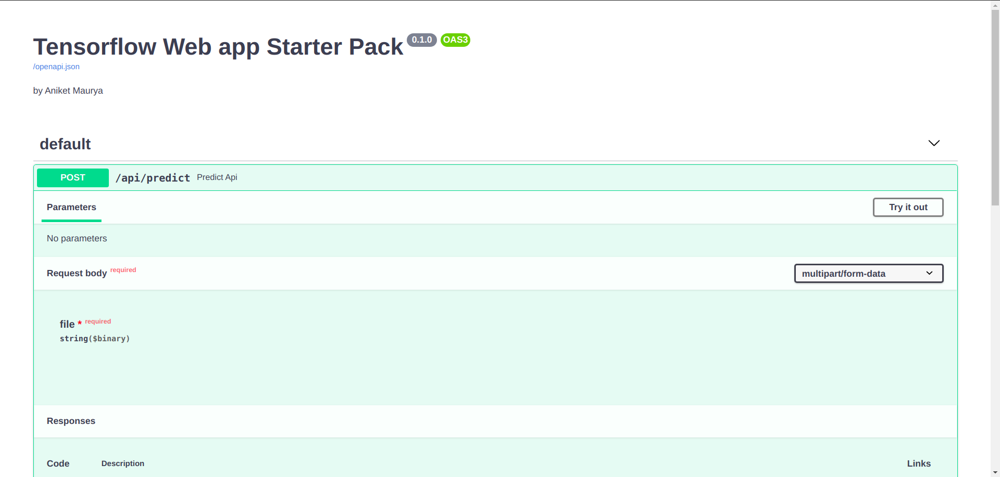
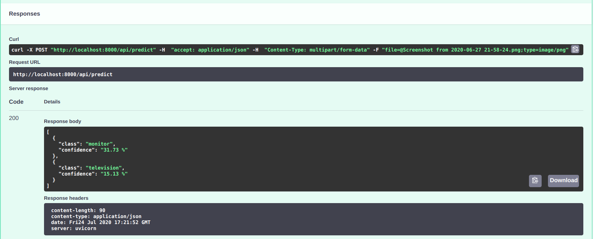

# tensorflow-web-app-starter-pack

This web app is created with [FastAPI](https://fastapi.tiangolo.com/) which is high performance asynchronous library for fast development of APIs.

It automatically generates SwaggerUI for APIs.

## Upload any photo andd try it out at https://tf-webapp.herokuapp.com/

## How to run?

`uvicorn application.server.main:app`

## Screenshots

### SwaggerUI

### Response

